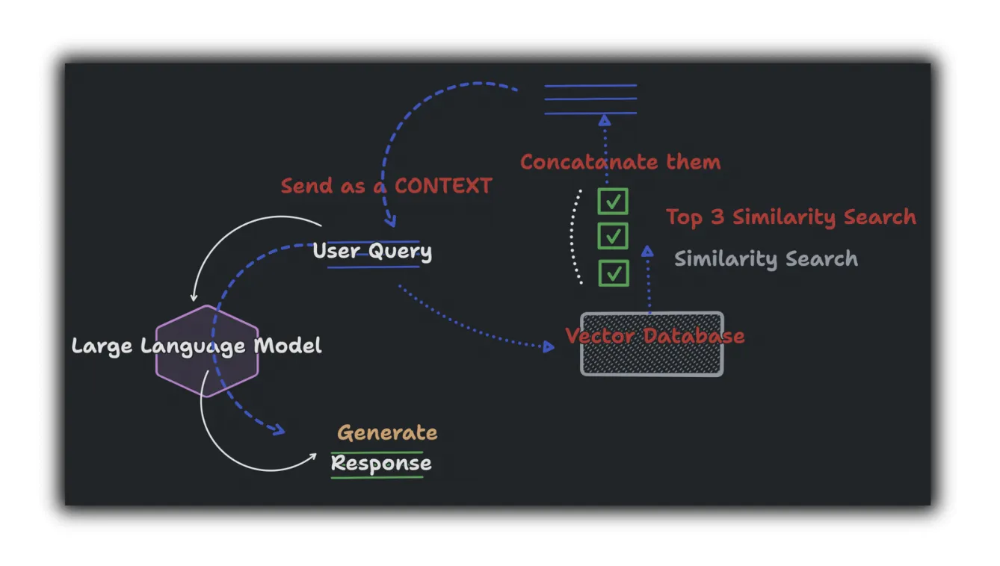

# 🧠 Chatbot Using RAG and LangChain

A Streamlit-based chatbot powered by Retrieval-Augmented Generation (RAG) and OpenAI. Upload your PDFs and chat with them! This app leverages LangChain, FAISS, and OpenAI’s GPT models to extract and query document content with metadata-aware answers.



---

## 🔧 Features

* 🔍 **Upload multiple PDFs** and query across all of them
* 📄 **Metadata-rich answers** with filename and page references
* 🧠 Uses **LangChain + FAISS** for semantic search
* 🤖 **Streamlit Chat UI** for natural conversation
* 💾 **OpenAI API support** with streaming responses

---

## 📁 Project Structure

```
.
├── .gitignore
├── LICENSE
├── README.md             # ← You're reading it
├── app.py                # Main Streamlit app
├── brain.py              # PDF parsing and vector index logic
├── compare medium.gif    # Optional UI illustration
├── requirements.txt      # Python dependencies
└── thumbnail.webp        # Preview image
```

---

## 🚀 Getting Started

### 1. Clone the Repository

```bash
git clone https://github.com/co-dev0909/chatbot-using-rag-and-langchain.git
cd chatbot-using-rag-and-langchain
```

### 2. Install Dependencies

```bash
pip install -r requirements.txt
```

### 3. Set OpenAI API Key

Create a `.streamlit/secrets.toml` file with:

```toml
OPENAI_API_KEY = "your-openai-key"
```

Or export it via environment variable:

```bash
export OPENAI_API_KEY="your-openai-key"
```

### 4. Run the App

```bash
streamlit run app.py
```

---

## 📚 How It Works

1. **Upload PDFs** via the UI
2. Each PDF is parsed using `PyPDF2` and chunked via LangChain’s `RecursiveCharacterTextSplitter`
3. Chunks are embedded using OpenAI Embeddings
4. Stored in a FAISS vector store for semantic similarity search
5. Queries are matched to top PDF chunks and passed to ChatGPT with context
6. Answers include **file name** and **page number** metadata for citation

---

## 🛠️ Tech Stack

* [Streamlit](https://streamlit.io/) – UI framework
* [LangChain](https://www.langchain.com/) – PDF chunking and retrieval
* [FAISS](https://github.com/facebookresearch/faiss) – Vector search backend
* [OpenAI GPT](https://platform.openai.com/docs) – LLM-based answer generation
* [PyPDF2](https://pypi.org/project/pypdf/) – PDF parsing

---

## ✅ Example Prompt

> "What are the main points from the introduction?"

> Answer: The introduction highlights... **(example.pdf, page 1)**

---

## 📄 License

This project is licensed under the [MIT License](LICENSE).

---

## 📬 Contact

Made with ❤️ by [co-dev0909](https://github.com/co-dev0909). Contributions welcome!

---
